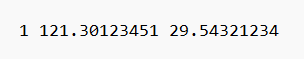
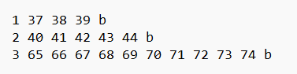

（1）本次无人机智能调度巡检正赛，赛题组将会给竞赛队伍提供某区域5000个杆塔分布图（仿真）用以算法调试，并最终提供类似区域的不少于5000个杆塔分布图（仿真）进行最终的比测。

（2）赛题最多可配置机巢十个、无人机十架，每个机巢同时只能停放一架无人机，且机巢之间不支持蛙跳操作。

（3）本次竞赛模拟运行时间为24小时，不考虑天气、地形、昼夜等因素影响。

（4）无人机飞行速度为5公里/小时，仅考虑无人机飞行时间与充电时间，起落时间、在杆塔处拍照时间等均忽略不计。

（5）无人机根据飞行距离计算耗电量，耗电量与飞行距离为线性关系，充电时间与耗电量为线性关系。无人机在机巢内，电池从零至充满时间为1小时。无人机在飞行时，电池从满电到零，可飞行8公里。

（6）无人机完成一次作业后，需充满电才可执行下一项任务。

（7）赛题系统会根据竞赛团队提供的线路按顺序执行，若无人机在某次飞行中，飞行总里程超过8公里，则视为飞机坠机，该飞机无法执行后续任务。

（8）竞赛队伍获得杆塔数据之后，根据赛题要求进行计算，将得到的机巢点位以指定的格式写入到TXT文件里，然后导入到仿真系统，进而进行结果展示，如下图1所示，机巢选址txt文件内容为序号和机巢X、Y坐标组成。

（9）竞赛队伍生成机巢点位之后，按照赛题组的要求，生成各自的巡检策略，结果同样以指定的格式写入到TXT文件里，然后导入到仿真系统，进而进行结果展示和这一阶段的判分。如下图2所示，TXT文件每行代表一次巡检结果，每列分别是巡检序号、所巡检的杆塔点位标号、巡检结束字符b，其中，每执行一次巡检任务之后默认飞机充满电之后才能执行下一次巡检任务。

